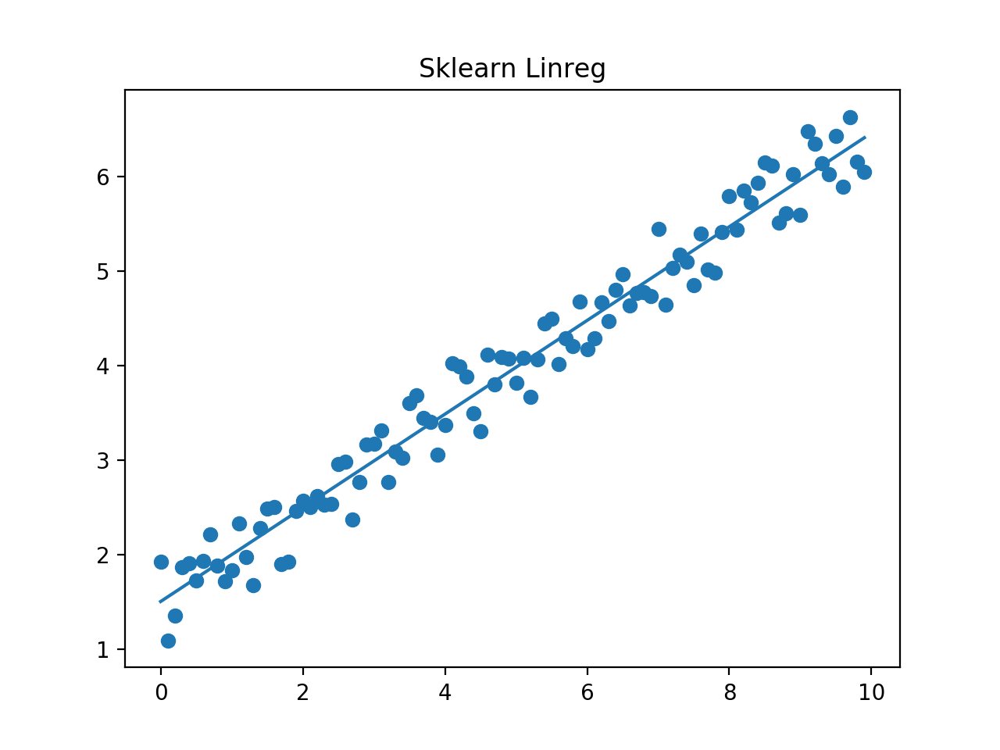

# 线性回归

【[html完整版](https://fdujiag.github.io/PyML/Supervise/LR/)】

【[返回主仓](https://github.com/FDUJiaG/PyML)】

# 说明

 ## 文档

此为监督学习中，线性回归的说明文档，由于github公式限制，建议阅读【[html完整版](https://fdujiag.github.io/PyML/Supervise/LR/)】

**主要使用的包**

```python
import numpy as np
import matplotlib.pyplot as plt
from sklearn.linear_model import LinearRegression
```

## 文件

| 文件                 | 说明                                       |
| -------------------- | ------------------------------------------ |
| Linear_Regression.py | 基于sklearn.linear_model的线性回归代码     |
| GD.py                | 基于随机梯度下降和批梯度下降的线性回归代码 |
| Normal_Equation.py   | 基于正规方程的线性回归代码                 |

# 回归问题

回归问题是非常常见的一类问题，目的是为了找寻变量之间的关系

比如要从数据中找寻房屋面积与价格的关系，年龄与身高的关系，气体压力和体积的关系等等

而机器学习要做的正是要让机器自己来学习这些关系，并为对未知的情况做出预测

# 示例

笔者选取一个$100$个点的测试集，构造点的方法为
$$
y=0.5\cdot x+1+\epsilon,\qquad 
x=\frac1{10}\times\{0,1,2,\cdots,99\},\quad 
\epsilon\in N(0,1)
$$

```python
def load_dataset(n):
    noise = np.random.rand(n)
    x = [[0.1 * x] for x in range(n)]
    y = [(0.5 * x[i][0] + 1.0 + noise[i]) for i in range(n)]
    return np.array(x), np.array(y)
```

由于各种方法图像大同小异，不累赘展示，只展示sklearn方法的那张，主要显示不同方法的$\theta$ 和$J(\theta)$ 

比较发现，还是官方的包比较厉害\^_\^

## sklearn.linear_model方法

```python
Data Shape (100, 1) (100,)
Sklearn_Theta [1.50443066 0.49577963]
Sklearn_Linreg_Loss 0.06843549998987704
```



## 梯度下降方法

```python
SGD_Theta [1.49585133 0.5197172 ]
SGD_Loss 0.10203149081311785
BGD_Theta [1.51903492 0.49953469]
BGD_Loss 0.08474175743613946
```

## 正规方程方法

```python
Normal_Equation_Theta [1.50538654 0.49582665]
Normal_Equation_y_pred
 [1.50538654 1.5549692  1.60455187 1.65413453 1.7037172  1.75329986
  1.80288253 1.85246519 1.90204786 1.95163052 2.00121319 2.05079585
  2.10037852 2.14996118 2.19954385 2.24912651 2.29870918 2.34829184
  2.3978745  2.44745717 2.49703983 2.5466225  2.59620516 2.64578783
  2.69537049 2.74495316 2.79453582 2.84411849 2.89370115 2.94328382
  2.99286648 3.04244915 3.09203181 3.14161448 3.19119714 3.24077981
  3.29036247 3.33994514 3.3895278  3.43911047 3.48869313 3.5382758
  3.58785846 3.63744113 3.68702379 3.73660645 3.78618912 3.83577178
  3.88535445 3.93493711 3.98451978 4.03410244 4.08368511 4.13326777
  4.18285044 4.2324331  4.28201577 4.33159843 4.3811811  4.43076376
  4.48034643 4.52992909 4.57951176 4.62909442 4.67867709 4.72825975
  4.77784242 4.82742508 4.87700775 4.92659041 4.97617307 5.02575574
  5.0753384  5.12492107 5.17450373 5.2240864  5.27366906 5.32325173
  5.37283439 5.42241706 5.47199972 5.52158239 5.57116505 5.62074772
  5.67033038 5.71991305 5.76949571 5.81907838 5.86866104 5.91824371
  5.96782637 6.01740904 6.0669917  6.11657437 6.16615703 6.2157397
  6.26532236 6.31490502 6.36448769 6.41407035]
Normal_Equation_Loss 0.0891981661368604
```

# 小结

回归一词指的是，我们根据之前的数据预测出一个准确的输出值，该值可以是连续变化的

【[返回顶部](#线性回归)】

【[html完整版](https://fdujiag.github.io/PyML/Supervise/LR/)】

【[返回主仓](https://github.com/FDUJiaG/PyML)】