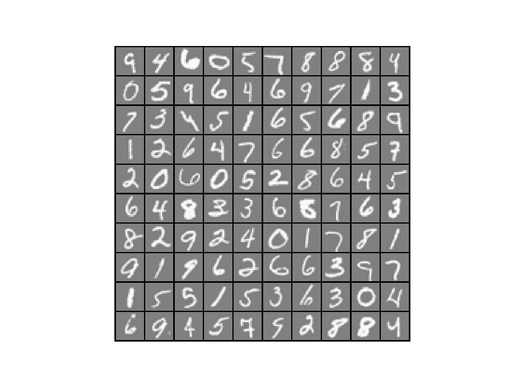
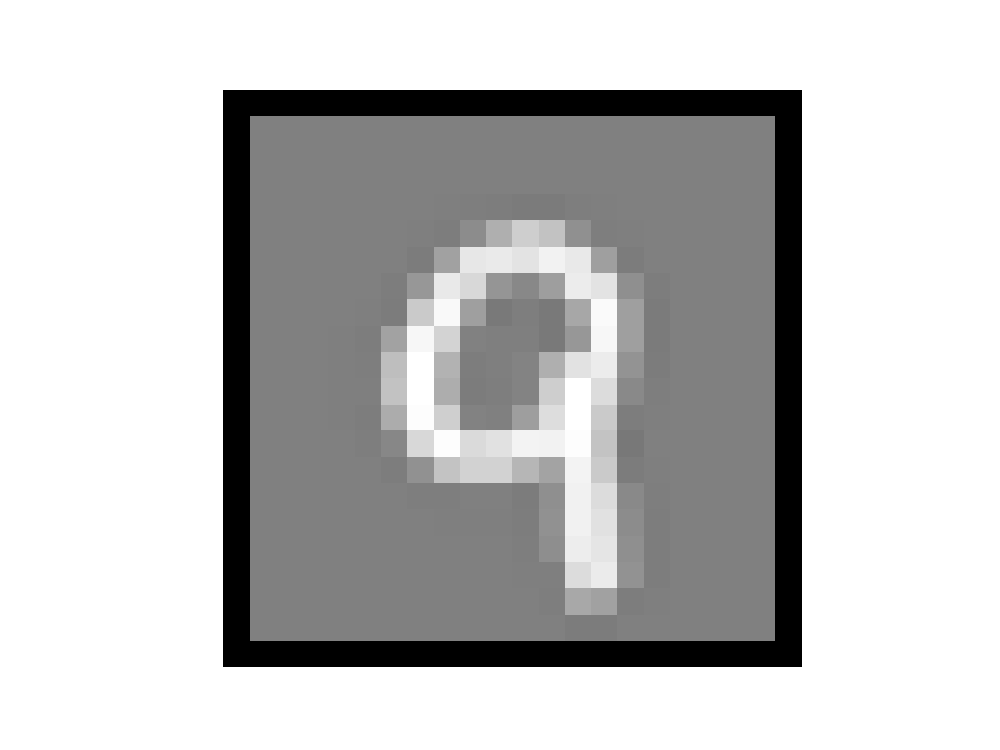
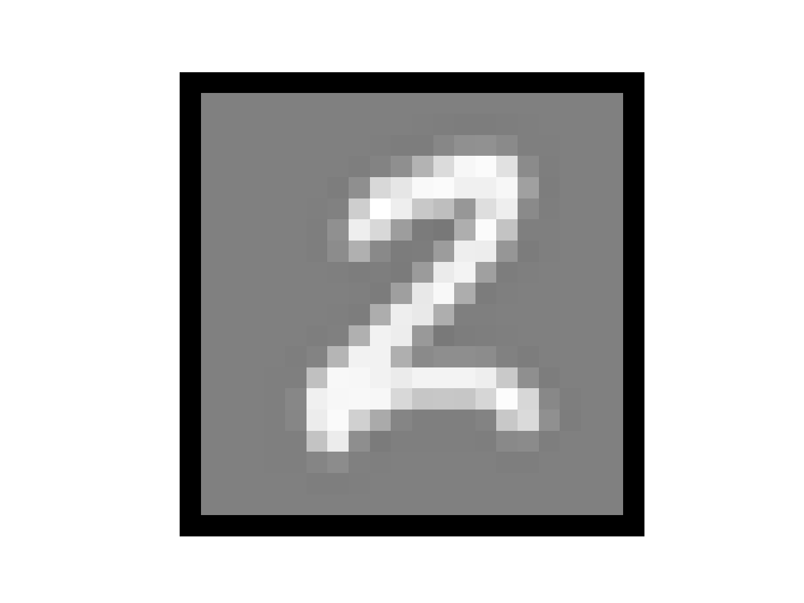
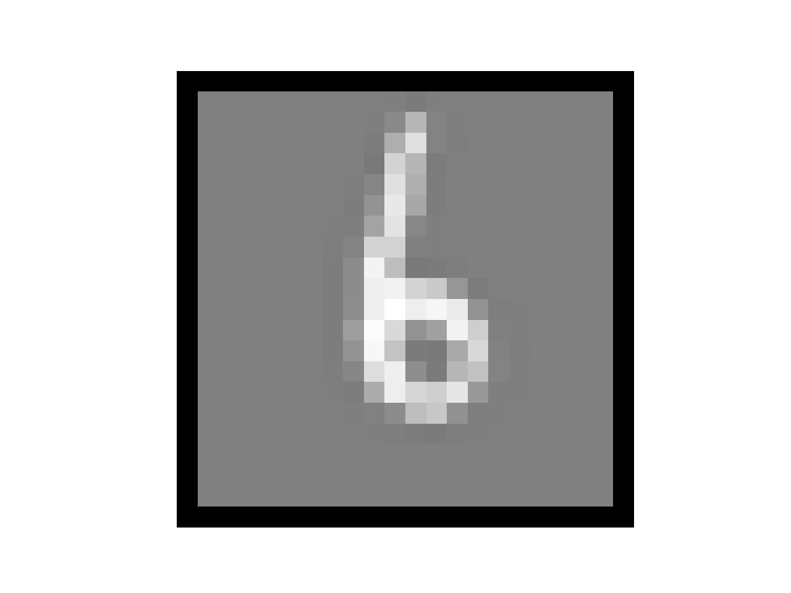

# 神经网络

【[html完整版](https://fdujiag.github.io/PyML/Supervise/Neural_Network/)】

【[返回主仓](https://github.com/FDUJiaG/PyML)】

# 说明

 ## 文档

此为监督学习中，神经回归的说明文档，由于 github 公式限制，建议阅读【[html完整版](https://fdujiag.github.io/PyML/Supervise/Neural_Network/)】

**主要使用的包**

```python
import numpy as np
import matplotlib.pyplot as plt
import scipy.io as sio
from scipy.optimize import minimize
```

## 文件

### MultiClass

【[**File of MultiClass**](https://github.com/FDUJiaG/PyML/tree/master/Supervise/Neural_Network/MultiClass)】

| 文件               | 说明                                                      |
| ------------------ | --------------------------------------------------------- |
| Softmax.py         | 基于 Softmax 的多分类脚本                                 |
| number_data.mat    | 手写体数字特征数据集： X [5000, 400], y [5000, 1]         |
| MultiClass.py      | 多分类主函数，对于每一类进行逻辑回归判断，返回预测准确率  |
| displayData.py     | 手写体数字样例呈现代码                                    |
| sigmoid.py         | sigmoid 函数                                              |
| oneVsAll.py        | 凸优化函数模块，方法为共轭梯度算法                        |
| lrCostFunction.py  | 损失函数及梯度计算模块                                    |
| predictOneVsAll.py | 多分类函数预测结果                                        |
| weights.mat        | 已训练好的 Theta 数据                                     |
| MultiClass_nn.py   | 基于训练好的 Theta ，执行 NN 过程的主函数，返回预测准确率 |
| predict.py         | 训练好的 Theta 执行 NN 过程的预测结果                     |

### Neural_Network

【[**File of Neural_Network**](https://github.com/FDUJiaG/PyML/tree/master/Supervise/Neural_Network/Neural_Network)】

| 文件                        | 说明                                              |
| --------------------------- | ------------------------------------------------- |
| number_data.mat             | 手写体数字特征数据集： X [5000, 400], y [5000, 1] |
| weights.mat                 | 已训练好的 Theta 数据                             |
| Neural_Network.py           | 神经网络主函数                                    |
| displayData.py              | 手写体样例呈现代码                                |
| sigmoid.py                  | sigmoid 函数                                      |
| sigmoidGradient.py          | 凸优化函数模块，方法为共轭梯度算法                |
| computeNumericalGradient.py | 利用有限差分法进行梯度的估算                      |
| nnCostFunction.py           | 神经网络损失函数及梯度计算模块                    |
| randInitializeWeights.py    | 随机初始化权值                                    |
| debugInitializeWeights.py   | 利用三角函数和层的尺寸调整权值                    |
| checkNNGradients.py         | 建立一个小型的神经网络用于验证反向传播梯度        |
| predict.py                  | 训练好的Theta执行NN过程的预测结果                 |

# 多分类问题

在 [**逻辑回归**](https://github.com/FDUJiaG/PyML/tree/master/Supervise/Logistic) 中，我们可以解决简单的 $\{0,1\}$ 分类问题，当我们需要解决特征量很大的非线性分类问题时（ 比如计算机视觉问题 ），我们原本假设高次特征的方法会使得特征数异常庞大，从而引出新的方法 **神经网络**

这次的新问题是手写字符识别，有一个手写字符的图片集合，每张图片都是一个 $\{0,1,2,\cdots,9\}$ 之间的手写数字，对于每张手写字符图片，我们要输出它是什么数字（ 下图是随机选取的 $100$ 张图片 ）

对于这个问题，我们的解决方法是训练 $10$ 个 $\{0,1\}$ 分类器，分别判断图片属于这个分类的概率（ **逻辑回归** 的输出 ），然后从这 $10$ 个结果中选取最大的作为结果，但为了更好地解决这类问题，我们需要引入新的方法

## 神经网络

神经网络是一种很古老的算法，这个算法诞生的目的是为了模拟大脑的算法从而建造智能机器

这个想法产生的原因是神经科学的研究表明大脑并非对不同的信号采取不同的处理方式（ 不同的算法 ），而是使用同一种来应对不同的信号（ 视觉、听觉等 ），这极大地激发了研究人员对寻找这种算法的热情，虽然期间由于各种技术问题（ 没有有效的训练算法和硬件速度限制 ）消声觅迹了一段时间，但最终凭借 **反向传播**、**共享权值**、**GPU加速** 等技术重现光辉，并成为现代机器学习技术中最有效的方法之一

# 示例

数据集采用 $5000$ 张 $20\times20$ 的手写体数字图像（已经特征化）

并且我们导入一些事先训练好的神经网络参数

```python
Loading and Visualizing Data ...

Loading Saved Neural Network Parameters ...
```

对于神经网络，首先应该实现只返回神经网络前馈部分的 Cost ，过程在 nncostfunction.m 中完成，在实现了计算前馈的 Cost 之后，验证在固定的调试参数上是否正确

```python
Feedforward Using Neural Network ...

cost value: 0.287629
Cost at parameters (loaded from weights): 0.287629        
(this value should be about 0.287629)
```

当前馈部分的 Cost 正确之后，我们还需要增加正则化项

```python
Checking Cost Function (w/ Regularization) ... 

cost value: 0.383770
Cost at parameters (loaded from weights): 0.383770        
(this value should be about 0.383770)
```

Sigmoid 函数梯度计算

```python
Evaluating sigmoid gradient...

Sigmoid gradient evaluated at [1 -0.5 0 0.5 1]:
  
[0.19661193 0.23500371 0.25       0.23500371 0.19661193]
```

然后我们开始一个两层的神经网络去区分手写体数字

首先需要对初始权重的进行设置

当我们的 Cost 和主流的情况匹配时（差距小于 1e-9），就可以执行神经网络的反向传播算法，返回相应的偏导数

```python
Initializing Neural Network Parameters ...

Checking Backpropagation... 

cost value: 2.099385
cost value: 2.099384
...
cost value: 2.099409
[ 1.76654044e-02  4.83605809e-04  7.06767168e-04  2.80130052e-04
  9.70879576e-03  2.36708468e-04  2.83653862e-04  6.98092035e-05
 -7.18128123e-03 -2.28610917e-04 -4.01542820e-04 -2.05298106e-04
 -1.74827533e-02 -4.83497643e-04 -7.17048672e-04 -2.91348459e-04
 -1.16920643e-02 -2.93754241e-04 -3.73295381e-04 -1.09630470e-04
  1.09347722e-01  5.67965185e-02  5.25298306e-02  5.53542907e-02
  5.59290833e-02  5.23534682e-02  1.08133003e-01  5.67319602e-02
  5.14442931e-02  5.48296085e-02  5.56926532e-02  5.11795651e-02
  5.06270372e-01  2.63880175e-01  2.41215476e-01  2.57977109e-01
  2.58731922e-01  2.40983787e-01]
[ 1.76654043e-02  4.83605811e-04  7.06767165e-04  2.80130055e-04
  9.70879575e-03  2.36708468e-04  2.83653860e-04  6.98092051e-05
 -7.18128122e-03 -2.28610917e-04 -4.01542819e-04 -2.05298105e-04
 -1.74827533e-02 -4.83497640e-04 -7.17048672e-04 -2.91348459e-04
 -1.16920643e-02 -2.93754241e-04 -3.73295381e-04 -1.09630469e-04
  1.09347722e-01  5.67965185e-02  5.25298306e-02  5.53542907e-02
  5.59290833e-02  5.23534682e-02  1.08133003e-01  5.67319602e-02
  5.14442931e-02  5.48296085e-02  5.56926532e-02  5.11795651e-02
  5.06270372e-01  2.63880175e-01  2.41215476e-01  2.57977109e-01
  2.58731922e-01  2.40983787e-01]
The above two columns you get should be very similar.
             (Left-Your Numerical Gradient, Right-Analytical Gradient)

If your backpropagation implementation is correct, then 
           the relative difference will be small (less than 1e-9). 
  
Relative Difference: 1.76077e-11
```

当反向传播的 Cost 正确之后，我们还需要增加正则化项

```python
Checking Backpropagation (w/ Regularization) ... 

cost value: 2.145957
cost value: 2.145955
...
cost value: 2.145976
[ 0.0176654   0.05504145  0.00917397 -0.04512802  0.0097088  -0.01652822
  0.03970285  0.0594313  -0.00718128 -0.03286988 -0.06040096 -0.03239967
 -0.01748275  0.05895294  0.03830022 -0.01756555 -0.01169206 -0.04535299
  0.00861934  0.05466708  0.10934772  0.11135436  0.06099703  0.00994614
 -0.00160637  0.03558854  0.108133    0.11609346  0.0761714   0.02218834
 -0.00430676  0.01898519  0.50627037  0.32331662  0.28023275  0.24070291
  0.20104807  0.19592455]
[ 0.0176654   0.05504145  0.00917397 -0.04512802  0.0097088  -0.01652822
  0.03970285  0.0594313  -0.00718128 -0.03286988 -0.06040096 -0.03239967
 -0.01748275  0.05895294  0.03830022 -0.01756555 -0.01169206 -0.04535299
  0.00861934  0.05466708  0.10934772  0.11135436  0.06099703  0.00994614
 -0.00160637  0.03558854  0.108133    0.11609346  0.0761714   0.02218834
 -0.00430676  0.01898519  0.50627037  0.32331662  0.28023275  0.24070291
  0.20104807  0.19592455]
The above two columns you get should be very similar.
             (Left-Your Numerical Gradient, Right-Analytical Gradient)

If your backpropagation implementation is correct, then 
           the relative difference will be small (less than 1e-9). 
           
Relative Difference: 1.73727e-11

cost value: 0.576051

Cost at (fixed) debugging parameters (w/ lambda = 10): 0.576051           
(this value should be about 0.576051)
```

然后我们开始训练自己的神经网络，区别于 matlab 或者 octave 中的 'fmincg' 和 'fminunc' 方法，还是使用scipy.optimize 中的 minimize 包来获取局部最小值点，method 为 'CG'（共轭梯度算法），只要我们为这些高级优化器提供梯度计算，它们就能够有效地训练我们的 Cost 函数

```python
Training Neural Network... 

cost value: 6.950881
cost value: 6.950881
...
cost value: 0.326665
cost value: 0.326656
```

在训练神经网络之后，我们想用它来预测标签

使用神经网络来预测训练集的标签，并可以计算训练集的精度（示例的精度超过 $99\%$ ）

并可以展示样例图片和预测情况（这里举 $4$ 个例子）

```python
Training Set Accuracy: 99.380000

Displaying Example Image

Neural Network Prediction: 9 (digit 0)

Displaying Example Image
  
Neural Network Prediction: 8 (digit 9)

Displaying Example Image

Neural Network Prediction: 1 (digit 2)

Displaying Example Image

Neural Network Prediction: 5 (digit 6)
```

      

# 小结

## 网络结构

决定选择多少层以及决定每层分别有多少个单元

- 第一层的单元数即我们训练集的特征数量

- 最后一层的单元数是我们训练集的结果的类的数量

- 如果隐藏层数大于 $1$ ，确保每个隐藏层的单元个数相同，通常情况下隐藏层单元的个数越多越好
- 我们真正要决定的是隐藏层的层数和每个中间层的单元数。

## 训练神经网络

1. 参数的随机初始化

2. 利用正向传播方法计算所有的 $h_\theta(x)$ 

3. 编写计算代价函数 $J$ 的代码

4. 利用反向传播方法计算所有偏导数

5. 利用数值检验方法检验这些偏导数

6. 使用优化算法来最小化代价函数


【[html完整版](https://fdujiag.github.io/PyML/Supervise/Neural_Network/)】

【[返回神经网络专题](https://github.com/FDUJiaG/PyML/tree/master/Supervise/Neural_Network)】

【[返回主仓](https://github.com/FDUJiaG/PyML)】