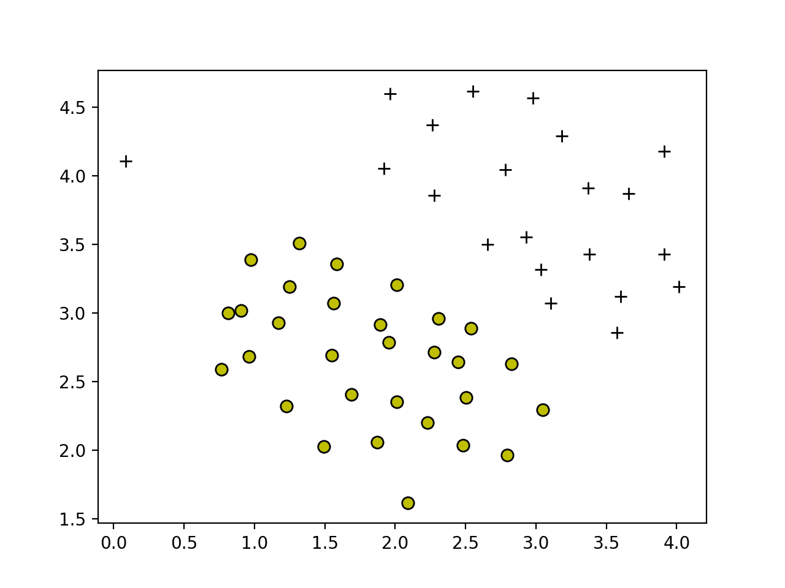
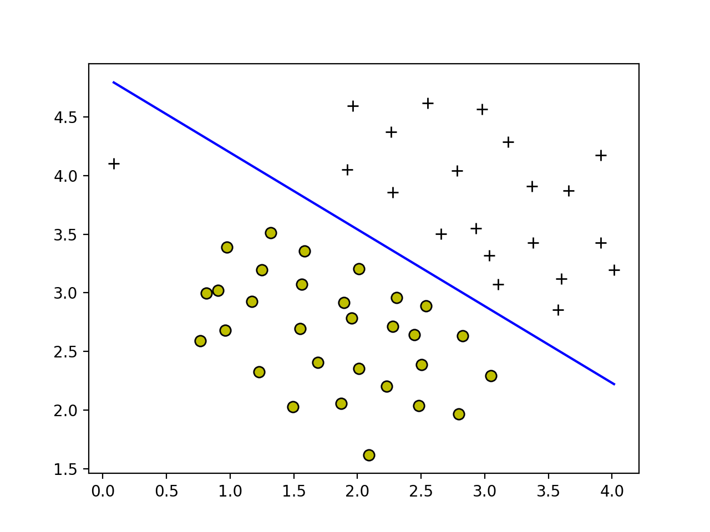
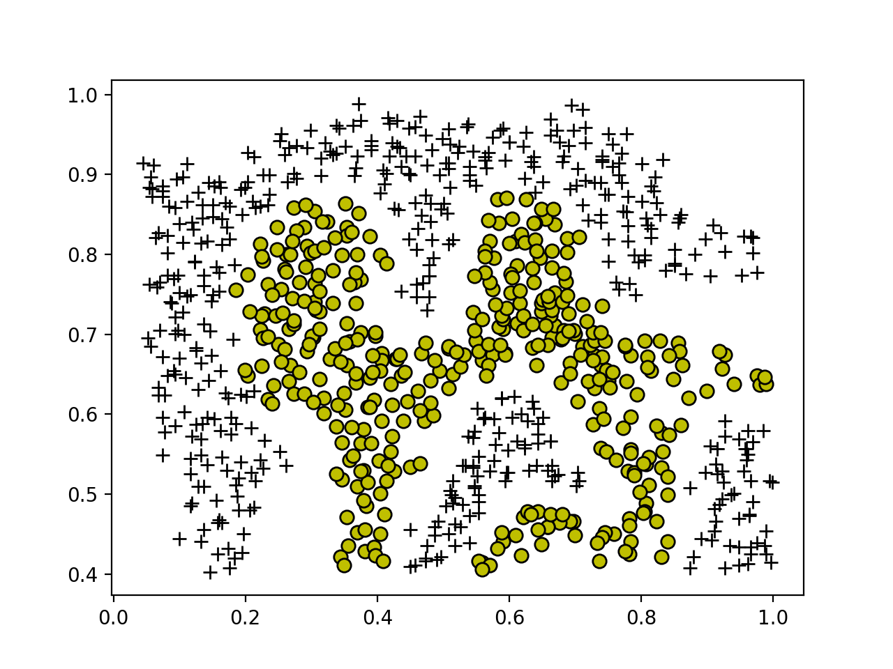
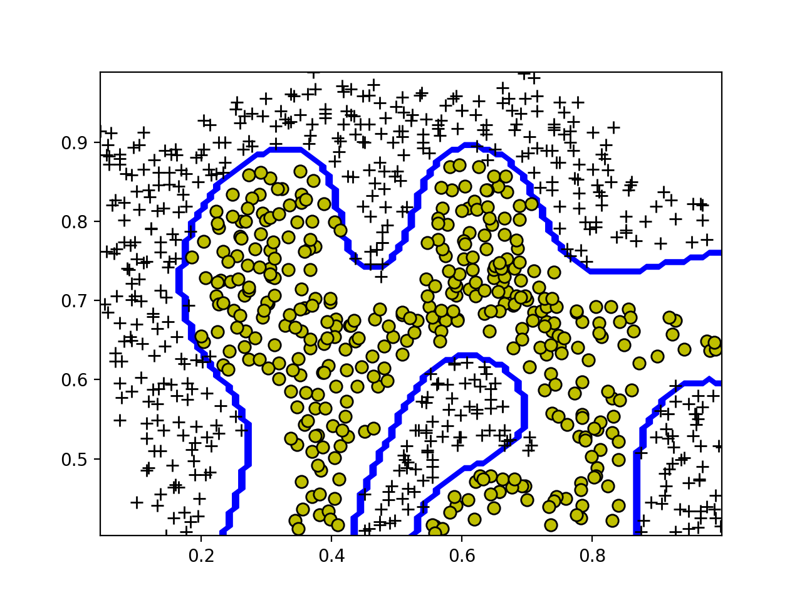
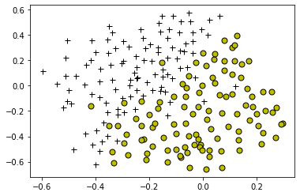
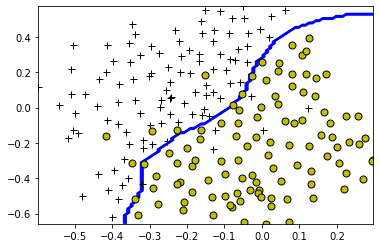

# 支持向量机

【[html完整版](https://fdujiag.github.io/PyML/Supervise/SVM/)】

【[返回主仓](https://github.com/FDUJiaG/PyML)】

# 说明

 ## 文档

此为监督学习中，支持向量机的说明文档，由于 github 公式限制，建议阅读【[html完整版](https://fdujiag.github.io/PyML/Supervise/SVM/)】

**主要使用的包**

```python
import numpy as np
import pandas as pd
from sklearn.datasets import load_iris
from sklearn.model_selection import  train_test_split
from random import random
from sklearn.svm import SVC
```

## 文件

| 文件              | 说明                                       |
| ----------------- | ------------------------------------------ |
| svm.py            | 简单的 SVM 实现代码                        |
| svm.ipynb         | jupyter文档，简单的 SVM 示例               |
| data_generater.py | 随机从load_iris选取数据集的代码            |
| smo.pdf           | SMO 算法的详细说明                         |
| SVM               | 文件夹，SVM 实现代码，线性、非线性、正则化 |

## SVM 文件

| 文件                       | 说明                                                    |
| -------------------------- | ------------------------------------------------------- |
| data1.mat                  | 线性可分的数据集： X: [51, 2]; y: [51, 1]               |
| data2.mat                  | 非线性的数据集： X: [863, 2]; y: [863, 1]               |
| data3.mat                  | 含有少量异常点的数据集： Xval: [200, 2]; yval: [200, 1] |
| svm.py                     | SVM 主函数，训练后返回对三个数据集的呈现及分类情况      |
| plotData.py                | 画图函数                                                |
| linearKernel.py            | 线性核函数代码                                          |
| gaussianKernel.py          | 高斯核函数代码                                          |
| svmTrain.py                | 基于 SMO 算法的 SVM 分类训练函数                        |
| svmProdict.py              | 基于训练模型，返回一个预测的向量                        |
| visualizeBoundary.py       | 在 SVM 训练后返回一个非画线的分类边界                   |
| visualizeBoundaryLinear.py | 在 SVM 训练后返回一个画线的分类边界                     |

# 数据点分类示例

## 训练线性 SVM 模型

```python
Training Linear SVM ...

Training ......................................................................
................................................ Done! 

{'X': array([[3.5772  , 2.856   ],
       [3.3814  , 3.4291  ],
       [3.1048  , 3.0709  ],
       [1.9182  , 4.0534  ],
       [2.6555  , 3.5008  ],
       [3.0357  , 3.3165  ],
       [1.5841  , 3.3575  ],
       [2.0103  , 3.2039  ],
       [2.3099  , 2.9584  ],
       [2.8283  , 2.6309  ],
       [1.3191  , 3.5109  ],
       [2.4482  , 2.6411  ],
       [2.7938  , 1.9656  ],
       [2.5403  , 2.8867  ],
       [0.086405, 4.1045  ]]), 'y': array([[ 1],
       [ 1],
       [ 1],
       [ 1],
       [ 1],
       [ 1],
       [-1],
       [-1],
       [-1],
       [-1],
       [-1],
       [-1],
       [-1],
       [-1],
       [ 1]]), 'kernelFunction': <function linearKernel at 0x10f40dcb0>, 'b': array([-10.38276639]), 'alphas': array([[1.00000000e+00],
       [3.62123526e-17],
       [1.00000000e+00],
       [6.01117180e-01],
       [1.00000000e+00],
       [9.25525691e-01],
       [1.00000000e+00],
       [1.00000000e+00],
       [1.00000000e+00],
       [1.00000000e+00],
       [5.26642871e-01],
       [6.93889390e-18],
       [2.77555756e-17],
       [1.00000000e+00],
       [1.00000000e+00]]), 'w': array([[1.4189917 ],
       [2.15188388]])}
```

分类效果



## 利用高斯核函数训练非线性的 SVM 模型

```python
Evaluating the Gaussian Kernel ...

Gaussian Kernel between x1 = [1; 2; 1], x2 = [0; 4; -1], sigma = 0.5 :
	%lf
(this value should be about 0.324652)
 0.32465246735834974

Loading and Visualizing Data ...

Training SVM with RBF Kernel (this may take 1 to 2 minutes) ...

Training ......................................................................
...............................................................................
...............................................................................
............................................................... Done! 
```

分类效果



## SVM 对于有少量异常点的分类效果

              

# 小结

在真实的环境中，非线性问题比线性问题要多的多，如果 SVM 只能处理线性问题，那大大局限了它的使用范围，核函数就是这么一把利器，能够把 SVM 在线性回归里面的整套逻辑无缝的运用到非线性问题上，并且更好的是计算量并没有太多的提升，值得一提的是核函数并不是 SVM 模型发明出来的，它是一套数学的简化计算的方法原理，只要符合它的使用条件，都可以运用核函数的方式简化运算


【[返回顶部](#线性回归)】

【[html完整版](https://fdujiag.github.io/PyML/Supervise/SVM/)】

【[返回主仓](https://github.com/FDUJiaG/PyML)】